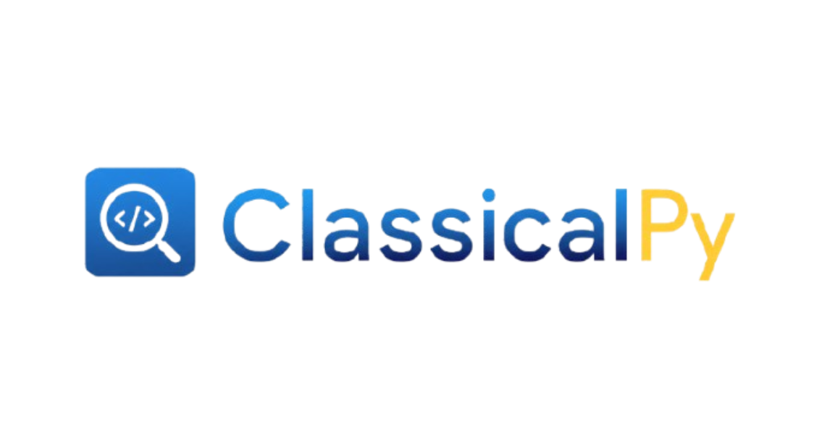

<p align="center">
  
</p>

**Entiende cualquier proyecto web en cinco minutos, no en cinco días.**

ClassicalPy analiza una carpeta local o un repositorio Git y genera un informe de
arquitectura en cinco secciones, escrito para que lo entiendan tanto perfiles
técnicos como no técnicos:

| Sección | Responde a |
| --- | --- |
| 🎯 Explicación en 5 segundos | ¿Qué hace esto y para quién? |
| 🏗️ Ficha Técnica y Arquitectura | ¿Con qué está construido y por qué cada pieza? |
| 🔄 Flujo de Trabajo Principal | ¿Qué recorre una petición de la interfaz al dato? |
| 📂 Mapa Conceptual de Módulos | ¿De qué es responsable cada carpeta? |
| 💡 Diagnóstico del Código | ¿Qué está bien resuelto y dónde hay deuda técnica? |

## Cómo funciona

El análisis es **estático y determinista**:

- **No ejecuta** el código analizado.
- **No llama a ninguna API** de pago ni gratuita. Funciona sin conexión.
- El motor es **Python estándar puro**, sin dependencias.

En lugar de un modelo de lenguaje, usa una **base de conocimiento curada** de más
de 160 dependencias del ecosistema web (Node, Python, PHP, Go, Rust, Ruby, Java)
que traduce cada paquete a la *función estratégica* que cumple dentro de una
arquitectura — no a la descripción oficial de su documentación.

Esto tiene un límite honesto que conviene conocer: ClassicalPy razona sobre
**estructura, manifiestos y vocabulario**, no sobre la semántica del código. Puede
decirte que `services/` contiene la lógica de negocio y que Prisma es la capa de
persistencia; no puede decirte si esa lógica es correcta. Cada deducción viene
etiquetada con su nivel de confianza y con la evidencia que la sustenta.

## Instalación

Requiere **Python 3.11 o superior**.

```bash
git clone <este-repositorio>
cd ClassicalPy
pip install -e ".[web,dev]"     # solo el motor y la CLI: pip install -e .
```

## Uso

### Línea de comandos

```bash
classicalpy analizar .                                      # carpeta actual
classicalpy analizar ../mi-tienda --salida informe.md       # a fichero
classicalpy analizar https://github.com/pallets/flask       # repositorio remoto
classicalpy analizar . --formato json                       # markdown | json | texto
```

Sin instalar el paquete: `python -m classicalpy analizar .`

### Interfaz web

```bash
classicalpy servir                    # http://127.0.0.1:8000
classicalpy servir --puerto 9000 --recargar
```

Pega una ruta o una URL de repositorio y obtienes el informe navegable, con
botones para copiarlo en Markdown o JSON. Tema claro/oscuro incluido.

### API HTTP

La misma funcionalidad, expuesta como API pública. Documentación interactiva en
`/docs` (OpenAPI, generada por FastAPI).

```bash
curl -X POST http://127.0.0.1:8000/api/analizar \
  -H "Content-Type: application/json" \
  -d '{"fuente": "https://github.com/pallets/flask", "formato": "json"}'
```

| Endpoint | Método | Descripción |
| --- | --- | --- |
| `/api/salud` | GET | Estado del servicio y capacidades activas |
| `/api/analizar` | POST | Analiza `fuente` y devuelve el informe en `formato` |
| `/docs` | GET | Documentación OpenAPI interactiva |

### Como librería

```python
from classicalpy import analizar
from classicalpy.report import render

informe = analizar("./mi-proyecto")

print(informe.architecture.pattern)              # "Monolito web (servidor + interfaz…)"
print(informe.domain.end_user)                   # quién usa la aplicación
for hallazgo in informe.findings:
    print(hallazgo.kind.value, hallazgo.title)

print(render(informe, "markdown"))
```

## ⚠️ Nota de seguridad

ClassicalPy clona y lee repositorios arbitrarios de terceros: es un servicio
diseñado para recibir entrada no confiable. Esto es lo que se ha endurecido y
lo que sigue siendo responsabilidad de quien lo despliega.

**Cubierto por el propio código:**

- **Lectura de ficheros del servidor.** `/api/analizar` puede analizar rutas
  locales del disco donde corre el proceso. Por eso escucha en `127.0.0.1` por
  defecto, y `classicalpy servir` **se niega a arrancar** en una interfaz no
  local si no se activa `CLASSICALPY_SOLO_REPOS=1` (o, si asumes el riesgo a
  propósito, `--permitir-analisis-local-publico`):

  ```bash
  CLASSICALPY_SOLO_REPOS=1 classicalpy servir --host 0.0.0.0
  ```

- **Symlinks dentro de un repositorio ajeno.** Un repositorio público podría
  incluir, por ejemplo, `README.md -> /etc/passwd` (o hacia un `.env`, una
  clave o una credencial montada en el contenedor) para que su contenido
  apareciera citado en el informe. El escáner **ignora cualquier symlink**
  encontrado dentro del árbol analizado.

- **SSRF y esquemas peligrosos en la URL del repositorio.** Solo se acepta
  `https://`; se rechazan `ssh://`, `git://` y la sintaxis `usuario@host:ruta`
  (evitan la clase de vulnerabilidad CVE-2017-1000117 y el protocolo `git://`
  sin cifrar). Además se rechaza clonar contra `localhost` o cualquier IP
  privada/de enlace local/loopback (`10.x`, `172.16-31.x`, `192.168.x`,
  `127.x`, `169.254.x`), como primera barrera contra sondear la red interna
  o los metadatos de la nube del propio servidor.

**Limitaciones conocidas, no cubiertas:**

- **DNS rebinding.** La comprobación de IP privada se hace sobre el host de
  la URL antes de clonar; si ese nombre resuelve a una IP distinta (privada)
  en el momento en que `git` hace la conexión real, esta capa no lo detecta.
  Si despliegas esto en una red con servicios internos sensibles, añade
  además un firewall de salida o un proxy que restrinja el tráfico saliente
  del proceso.
- **Tamaño del repositorio.** `--depth 1` limita el historial, no el árbol de
  trabajo: un repositorio público con un fichero enorme puede agotar disco.
  Hay un timeout de clonado (180s) que acota el peor caso, pero no un límite
  de bytes explícito.

## Arquitectura del propio proyecto

Un pipeline de cuatro etapas; cada una solo conoce la salida de la anterior.

```
  fuente (ruta o URL)
        │
        ▼
  ingest/    ── resuelve la fuente (clona si es Git) y recorre el árbol de ficheros
        │        → list[FileInfo] + ProjectStats
        ▼
  detect/    ── parsea manifiestos, condensa "señales", deduce stack y arquitectura
        │        → Signals + list[TechEntry] + ArchitectureGuess
        ▼
  analyze/   ── dominio, mapa de módulos, flujo de trabajo y diagnóstico
        │        → DomainGuess + list[ModuleNode] + list[FlowStep] + list[Finding]
        ▼
  report/    ── serializa a markdown / json / texto
        │
        ▼
  cli.py  ·  web/app.py        (dos interfaces, un solo motor)
```

`pipeline.py` es el único módulo donde se ve el proceso completo.

### Dónde tocar para extender

| Quiero… | Fichero |
| --- | --- |
| Reconocer una dependencia nueva | `detect/knowledge.py` |
| Añadir un patrón arquitectónico | `detect/stack.py` → `infer_architecture` |
| Describir un tipo de carpeta | `analyze/modules.py` → `FOLDER_ROLES` |
| Añadir vocabulario de negocio | `analyze/domain.py` → `DOMAIN_VOCABULARY` |
| Añadir una regla de diagnóstico | `analyze/diagnostics.py` → `RULES` |
| Trazar el flujo de un patrón | `analyze/flow.py` |

Añadir una regla de diagnóstico es escribir una función y registrarla en `RULES`:

```python
def _rule_mi_regla(sig: Signals, modules: list[ModuleNode]) -> list[Finding]:
    if not sig.has_dep("libreria-obsoleta"):
        return []
    return [_f(FindingKind.MEJORA, "Título", "Explicación.", "evidencia", "Impacto.")]
```

## Desarrollo

```bash
pytest              # 42 pruebas sobre proyectos sintéticos
ruff check .
```

Las pruebas no dependen de repositorios externos: `tests/conftest.py` fabrica
árboles de ficheros mínimos con exactamente las señales que cada caso verifica.

## Licencia

MIT.
